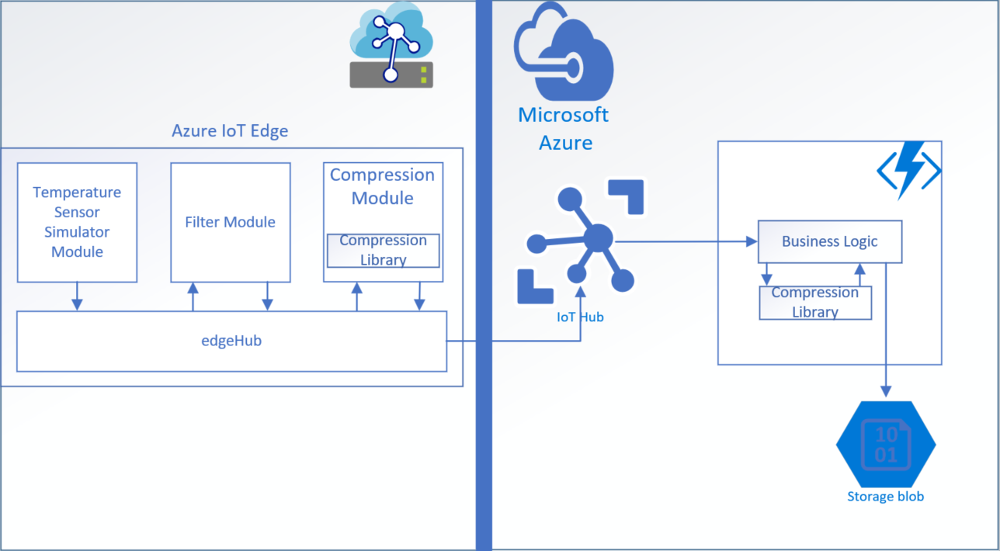

Complementary Code Pattern for Azure IoT Edge Modules & Cloud Applications

Core Pattern: 

In developing IoT solutions, there is often a need to perform one operation on the device and another complementary operation in the cloud or vice versa. Complementary operations such as compression and decompression, batching and shredding, encryption and decryption, encoding and decoding allow data to be transformed in one location and fully recovered in the other.  For example, compression/decompression enable sending smaller amounts of data and batch/shred enable sending multiple messages in one transmission.  The pattern established by the compression/decompression code can be incorporated in any one to one complementary operation.  Further, since the complementary code is packaged and separated from the IoT Edge module logic the operations can be incorporated into new modules or used in Azure applications by including the library.

Architecture Diagram:

"Architecture Diagram"

The separation of business logic and library logic allows for four primary benefits:

1)	Business Logic: By appropriately determining the separation of business logic and library logic, either can be modified independently of the other.  For example, if an improved compression algorithm or application specific algorithm (ie. images/video vs text) the library could be updated.  On the other hand, if preprocessing of the data due to increased compliance requirements changes, the library does not need to be updated while the business logic does.  Additional libraries could be added and used by the business logic without updating the library.
2)	Business Artifact Repository: By creating a library, code can be used across business units and applications.  Libraries which benefit all IoT devices such as compression/decompression and batch/shred, which assist with reducing bandwidth usage or improving data transmission, can be managed and distributed in one location.  Any library which could benefit or be used by more than one application would apply here.  Further, libraries can be hosted and maintained in a central repository.
3)	Unit Testing:  IoT Edge code presents a particularly interesting unit test case.  If the code is bundled into the business logic instead of separated out, it becomes extremely challenging to test.  The reason for this is the need to mock the IoT Edge Module Client before doing any testing of the actual code.  By separating the code into a library, unit testing can take a familiar pattern once again.  When incorporating the code directly, rather than from a registry, one caution to keep in mind, while creating the unit tests in the same code folder as the module, is to ensure that you do not include the module in the Docker deployment of the edge code.  In C#, the unit test code exists in a separate folder from the library code, so this should not be an issue since the library does not have a deployment.json file.  In Node, however, add the tests folder to a “.dockerignore” file in the same folder as the module.
4)	Business Logic Bidirectionality: Finally, by creating a library which contains both of the operations, it becomes easy to add the library to code on the device and in the cloud to perform the complementary operation.  In the example above, compression/decompression are bundled in a single library so (1) the complementary operations are easily identified, (2) they can be unit tested together to ensure that input through the chain results in the same output as entered and (3) the code can be shared on device and in the cloud without the need to create additional code for the operation.

