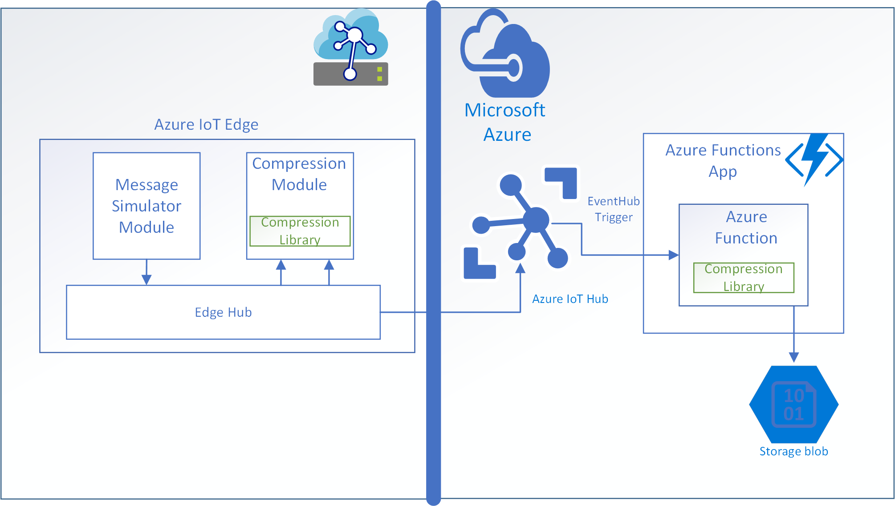

# Complementary Code Pattern for Azure IoT Edge Modules & Cloud Applications

This repo contains sample code which demonstrates the [Complementary Code](#Key-concepts) pattern with compression/decompression.

It includes an Azure IoT Edge deployment solution to build a module which compresses messages sent to Azure IoT Hub from other Azure IoT Edge modules on the same Edge device or other downstream devices. For demonstration, the deployment also includes a message simulator module that plays back sample messages stored on disk in a loop.  

The sample includes an Azure Functions project to build an Azure Function to receive messages from Azure IoT Hub, decompress them and write them to Azure Blob Storage.  

Finally, the compression/decompression code is shared across the Azure IoT Edge deployment solution and the Azure Functions solution. 

Versions of sample code are provided in both C#/.NET Core and Node.js.  The _csharp_ and _node_ folders are the root folders for the C#/.NET Core and Node.js versions of this sample respectively.  The root folders contain four directories - _cloud_ , _edge_, _messages_ and _shared_.

The _edge_ folder contains the Azure IoT Edge deployment solution to build the compression module, while the _cloud_ folder contains the Azure Functions project to receive messages from Azure IoT Hub, decompress the messages and write the messages to Azure Blob Storage.  The _shared_ folder contains the compression and decompression code used by both the IoT Edge compression module and Azure Function, along with unit tests for the shared code.  The _messages_ folder contains test messages that are played back by the message simulator module, which is included in the Azure IoT Edge deployment solution.

The sample code is configured to build and run in [Visual Studio Code](https://code.visualstudio.com/) (aka VSCode).  Visual Studio Code is a Microsoft cross platform code editor, which also includes powerful developer tooling, like IntelliSense code completion and debugging.  Visual Studio Code is available on Windows, Mac, and Linux and supports C# and Node debugging for Azure IoT Edge modules.

There are two Visual Studio Code workspace files, _edge.code-workspace_ and _cloud.code-workspace_ in the language root folders. After installing the development environment prerequisites (below), the Edge and cloud workspaces can be opened in Visual Studio Code with the corresponding _.workspace_ files.

## Contents

| File/folder | Description |
|-|-|
| `csharp` | folder containing .NET/C# version of sample |
| `csharp/edge.code-workspace`  | Visual Studio Code workspace to build .NET/C# Azure IoT Edge modules |
| `csharp/cloud.code-workspace` | Visual Studio Code workspace to build .NET/C# Azure Function |   
| `images` | images used in Markdown files |
| `node`| folder containg Node.js version of sample |
| `node/edge.code-workspace`  | Visual Studio Code workspace to build Node.js Azure IoT Edge modules |
| `node/cloud.code-workspace` | Visual Studio Code workspace to build Node.js Azure Function |   
| `.gitignore`      | Define what to ignore at commit time. |
| `CODE_OF_CONDUCT.md` | Microsoft Open Source Code of Conduct and FAQ |
| `EdgeDevelopment.md` | Azure IoT Edge development environment configuration |
| `ISSUE_TEMPLATE.md`  | Template for submitting issues on GitHub |
| `LICENSE`         | The license for the sample  |
| `README.md`       | This README file |
| `SECURITY.md`     | Instructions for filing security issues directly with Microsoft |

## Prerequisites

### Development machine prerequisites

The edge and cloud samples are designed to be built and run together on a development machine in Visual Studio Code using Docker CE, the Azure IoT EdgeHub Dev Tool and the Azure Functions Core Tools. Below are the prerequisites to build and run the sample on a local development machine: 

1. Language SDK's
    - [.NET Core SDK (2.1 or above)](https://www.microsoft.com/net/download) - only required for C# version of sample
    - [Node.js (8.5 or above)](https://nodejs.org) - required for Node version of sample and the Azure Functions Core Tools.
    - [Python (2.7/3.6 or above) and Pip](https://www.python.org/) - required for Azure IoT EdgeHub Dev Tool. **Windows users should select the option to add Python to the path.**

2. Docker

    [Docker Community Edition](https://docs.docker.com/install/) - required for Azure IoT Edge module development, deployment and debugging. Docker CE is free, but may require registration with Docker account to download.  Docker on Windows requires Hyper-V support.  Please make sure your Windows version supports Hyper-V.  For Windows 10, Hyper-V is available with the Pro or Enterprise versions.

3. Visual Studio Code and extensions
    
    > **Note**: Extensions can be installed either via links to the Visual Studio Code Marketplace below or by searching extensions by name in the Marketplace from the Extensions tab in Visual Studio Code.

    Install [Visual Studio Code](https://code.visualstudio.com/) first and then add the following extensions:

    - [C# extension](https://marketplace.visualstudio.com/items?itemName=ms-dotnettools.csharp) (only required for C# version of sample) - provides C# syntax checking, build and debug support
    - [ESLint](https://marketplace.visualstudio.com/items?itemName=dbaeumer.vscode-eslint) (only required for Node.js version of sample) - provides JavaScript syntax checking
    - [Azure IoT Tools](https://marketplace.visualstudio.com/items?itemName=vsciot-vscode.azure-iot-tools) - provides Azure IoT Edge development tooling

        > **Note**: Azure IoT Tools is an extension pack that installs 3 extensions that will show up in the Extensions pane in Visual Studio Code - *Azure IoT Hub Toolkit*, *Azure IoT Edge* and *Azure IoT Workbench*.

    - [Azure Functions](https://marketplace.visualstudio.com/items?itemName=ms-azuretools.vscode-azurefunctions)
 
4. ESLint (optional)

    Due to the Azure IoT Edge solution folder structure, ESLint must be installed globally to work with  Node.js Azure IoT Edge module JavaScript files.  

    ```bash
    npm install -g eslint
    ```

5. Azure IoT EdgeHub Dev Tool

    [Azure IoT EdgeHub Dev Tool](https://pypi.org/project/iotedgehubdev/) is a version of the Azure IoT Edge runtime for local development machine.  After verifying Python and Pip (2.7/3.6 or above) are installed and in the path, install **[iotedgehubdev](https://pypi.org/project/iotedgehubdev/)** with Pip:

    ```bash
    pip install --upgrade iotedgehubdev
    ```

6. Azure Functions Core Tools

    [Azure Functions Core Tools](https://github.com/Microsoft/vscode-azurefunctions/blob/master/README.md) is a version of the Azure Functions runtime for local development machine. It also provides commands to create functions, connect to Azure, and deploy Azure Function projects.  After verifying Node.js (8.5 or above) is installed and in the path, install **[azure-functions-core-tools](https://www.npmjs.com/package/azure-functions-core-tools)** with
    npm:

    ```bash
    npm install -g azure-functions-core-tools
    ```

7. Azure Storage Emulator (optional, Windows only)

    [AzureStorageEmulator](https://docs.microsoft.com/en-us/azure/storage/common/storage-use-emulator)  provides a local environment that emulates the Azure Blob, Queue, and Table services for development purposes.  Use the link for the standalone installer.

    Azure Blob Storage is required for the Azure Functions runtime for internal state management.  The Azure Function in this sample also writes decompressed messages to an Azure Storage account. 

    When running this sample locally on **Windows**, the Azure Storage Emulator can be used instead of creating an Azure Storage account.  The emulator will not work with **WSL** or **Linux** and a real storage account will be needed.

8. Azure Storage Explorer (optional)

    [Azure Storage Explorer]() provides a GUI for connecting to and managing Azure storage accounts and Azure Cosmos DB entities.  Azure Storage Emulator can be used to view and download blobs output by the sample, both from your Azure Storage account or the Azure Storage Emulator.

### Azure Prerequisites 

1. Azure IoT Hub Service

    To run the samples, you will need an Azure subscription and a provisioned Azure IoT Hub service. Every Azure subscription allows one free F1 tier Azure IoT Hub.  The F1 tier Azure IoT is sufficient for this sample. 

    [Create an IoT hub using the Azure portal](https://docs.microsoft.com/en-us/azure/iot-hub/quickstart-send-telemetry-dotnet#create-an-iot-hub)

2. Azure Storage 

    The Azure Functions runtime requires an Azure Storage account for internal state management.  The Azure Function in this sample also writes decompressed messages to an Azure Storage account.  An Azure Storage account is only required if Azure Storage Emulator is not being used.

    [Create an Azure Storage Account](https://docs.microsoft.com/en-us/azure/storage/common/storage-quickstart-create-account?tabs=azure-portal)

    >**Note**: For a real application, you would typically create separate storage account for Azure Functions state management and application output.

3. Azure Functions App (optional)

    This sample only requires the local Azure Functions Core Tools.  An Azure Functions application is only required if you wish to run the sample in Azure.

    [Create an Azure Functions App](https://docs.microsoft.com/en-us/azure/azure-functions/functions-create-first-azure-function#create-a-function-app)

4. Azure Container Registry (optional)

    This sample can be built and run in the local Azure IoT Edge Simulator without pushing Azure IoT Edge modules to a container registry.  A container registry is only needed when deploying to an actual Azure IoT Edge device.  Any Docker container registry can be used, including DockerHub and Azure Container Registry.

    [Create an Azure Container Registry](https://docs.microsoft.com/en-us/azure/container-registry/container-registry-get-started-portal)


## Setup

### Configure Azure IoT Edge development environment

1. Connect your Azure account to Visual Studio Code

   The *Azure IoT Tools* Visual Studio Code extension pack installs a prerequisite *Azure Account* extension if its not already present.  This extension allows Visual Studio Code to connect to your Azure subscription.  For this sample, Visual Studio Code needs to connect to you Azure IoT Hub service.

   Open the command palette and search for *Azure: Sign In*

   Select this command and you will be prompted to sign into your Azure account in a separate browser window.  After sign-in, you should see *Azure:* followed by your login account in the status bar at the bottom of Visual Studio Code.

2. Connect to your Azure IoT Hub

   There are 2 ways to connect to your Azure IoT Hub from within Visual Studio Code:

   Open the command palette and search for *Azure IoT Hub: Select IoT Hub* 

   ​	**or**

   With the Explorer icon in the Visual Studio Code Activity Bar selected, go to the *AZURE IOT HUB* section in the Explorer pane of Visual Studio Code.  Select the "..." to open the Azure IoT Hub context menu.  From the Context Menu, choose *Select IoT Hub*.  

   Both options will open a selection list of available subscriptions at the top of the Visual Studio window.  After selecting your subscription, all available Azure IoT Hubs in your subscription will be presented in another selection list.  After selecting your Azure IoT Hub, the *AZURE IOT HUB** section in the Explorer pane of Visual Studio Code will be populated with configured Devices and Endpoints.  The Devices list will initially be empty for a new Azure IoT Hub.

3. Create an Azure IoT Edge device 

   This sample is designed to run in the Azure IoT Edge Simulator on a local development machine.  However, the Simulator still connects to your Azure IoT Hub service, and therefore needs an Azure IoT Edge device definition in Azure IoT Hub.  You can create an Azure IoT Edge device in the Azure portal, but its easier from Visual Studio Code with the Azure IoT Edge extension installed.

   There are 2 ways to create an Azure IoT Edge device from Visual Studio Code:

   Open the command palette and search for *Azure IoT Hub: Create IoT Edge Device*. 

   ​	**or**

   With the Explorer icon in the Visual Studio Code Activity Bar selected, go to the *AZURE IOT HUB* section in the Explorer pane of Visual Studio Code.  Select the "..." to open the Azure IoT Hub context menu.  From the Context Menu, choose *Create IoT Edge Device*. 

   Both options will open a prompt for you to enter the name of the device.

   > **Note:** There is also a *Azure IoT Hub: Create Device* command.  This creates a basic IoT device definition, which does not support the Azure IoT Edge Runtime and does not work with the Azure IoT Edge Simulator.

4. Configure Azure IoT Edge Simulator to use your Edge Device identity

   Again, there are 2 ways to create setup the Azure IoT Edge Simulator from within Visual Studio Code 

   Open the palette and search for *Azure IoT Edge: Setup IoT Edge Simulator*.  After selecting the command, a list of devices is displayed.  Select the device you created in the previous step. 

    **or**

   With the Explorer icon in the Visual Studio Code Activity Bar selected, go to the *AZURE IOT HUB* section in the Explorer pane of Visual Studio Code.  Expand the Devices list, and right click on the device you created in the previous step to open the Context Menu.  Select *Setup IoT Edge Simulator* from the Context Menu. 
   
   This command will pass your Edge device credentials to the Azure IoT Edge Simulator via a command in the Terminal Window.
   
   > **Note:** If you try to use the *Setup IoT Edge Simulator* command without first connecting to your Azure IoT Hub, you will instead be prompted to enter the connection string for an Azure IoT Hub device.
   
5. Set environment variables

   The Azure IoT Edge solution deployment manifests (*deployment.template.json* and *deployment.debug.template.json*) and module metadata files (*module.json*) support environment variable substitution.  There are 3 environment variable placeholders used in this sample - *$CONTAINER_REGISTRY_USERNAME*, *$CONTAINER_REGISTRY_PASSWORD* and *$CONTAINER_REGISTRY_ADDRESS*.  These are used to specify your container registry address and login credentials.  To run the code in the Azure IoT Edge Simulator, the *$CONTAINER_REGISTRY_ADDRESS* can be set to the Docker local registry container value of *localhost:5000*.  When using the local registry container value, the $CONTAINER_REGISTRY_USERNAME and $CONTAINER_REGISTRY_PASSWORD are not used.  However, since they are defined in the deployment manifests, they must be defined in order to avoid the "Please set registry credential to .env file." warning message on initial load.  
   To protect secrets, *.env* files should not be included in source control. Therefore, this sample includes a *.env.temp* template file that can be renamed to *.env*  or the values can be copied to your .env file.  To build and run the sample in the Azure IoT Edge Simulator, the following values can be used:

   ```
   CONTAINER_REGISTRY_ADDRESS=localhost:5000
   CONTAINER_REGISTRY_USERNAME=<registry username>
   CONTAINER_REGISTRY_PASSWORD=<registry password>
   ```
   > **Note:** *CONTAINER_REGISTRY_USERNAME* and *CONTAINER_REGISTRY_PASSWORD* are not used with the local registry container (*localhost:5000*), but these variables must be defined with any non-empty value. 

   If you wish to deploy the solution to a real Edge device, make sure to set the values to your container registry.    

6. Verify Docker runtime mode (**Windows only**)

   This sample is built to run in an Ubuntu container and requires a Linux Container runtime. If running on Windows, make sure that that Docker CE is running in the default Linux container mode, not Windows container mode. 

   You can do this by right clicking the Docker icon in the system tray.  If the context menu shows "Switch to Windows containers...", Docker is running in Linux container mode. 

7. Select your target architecture

   Currently, the Azure IoT Edge Visual Studio Code can build Azure IoT modules targeting *amd64* (Linux), *arm32* (Linux) and *windows-amd64*.  The target architecture setting tells the Azure IoT Edge extension which Dockerfile to use in each module directory.  This tutorial only included Dockerfiles that target Linux, so make sure the default *amd64* is selected.

   If *amd64* is not shown next to the Edge icon  in the status bar at the bottom of Visual Studio, either select this icon to change the target platform or search for *Azure IoT Edge: Set Default Target Platform for Edge Solution* in the command palette.

### Configure Azure Functions development environment

The Azure Functions development environment configuration is different for the .NET/C# and Node.js versions of this sample.  Refer to the instructions in the *README.md* files located in the _cloud_ workspace (_cloud.code-workspace_) under the *csharp* and *node* language folders.

## Running the sample

The Azure IoT Edge solution (*edge* folder) and Azure Functions app (*cloud* folder) are designed to be run side-by-side in two instances of Visual Studio Code.  

To run the sample, open the _edge.code-workspace_ and _cloud.code-workspace_ files in Visual Studio code under either the _csharp_ or _node_ language root folders, and follow the additional instructions in the *README.md* files located in the _edge_ and _cloud_ folders in the Visual Studio code workspaces. 
## Key concepts

### Complementary Code Pattern for Azure IoT Edge Modules & Cloud Applications

In developing IoT solutions, there is often a need to perform one operation on the device and another complementary operation in the cloud or vice versa. Complementary operations such as compression/decompression, batching/shredding, encryption/decryption, encoding/decoding allow data to be transformed in one location and fully recovered in the other.  For example, compression/decompression enables sending smaller amounts of data and batching/shredding enables sending multiple messages in one transmission. 

In addition to the benefits of code reuse, separating out complementary code helps with unit testing, which can be  difficult for Azure IoT Edge Modules as well as many cloud services.  Azure IoT Edge Modules rely on a *ModuleClient* object to communicate with the Azure IoT Hub service.  The *ModuleClient* object can only be instantiated while the module is executing under the Azure IoT Edge runtime.  Likewise, user code in many cloud services is also difficult to unit test because the code relies on infrastructure that is only present when running in the cloud service environment.  For example, Azure Functions communicate with other Azure services via runtime *bindings* that are surfaced as various runtime objects in the supported languages.  By separating the complementary code and other business logic into a library, unit testing can follow a familiar pattern once again, minimizing the amount of code that can be exercised through integration testing.

This sample demonstrates the Complementary Code pattern using compression/decompression, as shown below:



## Contributing

This project welcomes contributions and suggestions.  Most contributions require you to agree to a
Contributor License Agreement (CLA) declaring that you have the right to, and actually do, grant us
the rights to use your contribution. For details, visit https://cla.opensource.microsoft.com.

When you submit a pull request, a CLA bot will automatically determine whether you need to provide
a CLA and decorate the PR appropriately (e.g., status check, comment). Simply follow the instructions
provided by the bot. You will only need to do this once across all repos using our CLA.

This project has adopted the [Microsoft Open Source Code of Conduct](https://opensource.microsoft.com/codeofconduct/).
For more information see the [Code of Conduct FAQ](https://opensource.microsoft.com/codeofconduct/faq/) or
contact [opencode@microsoft.com](mailto:opencode@microsoft.com) with any additional questions or comments.
