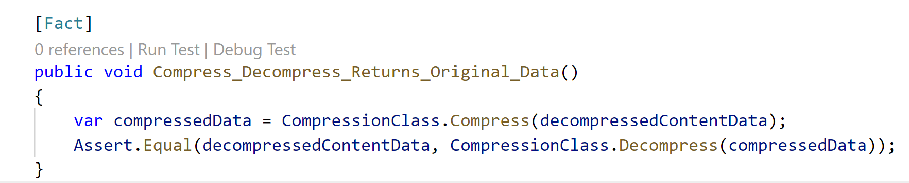

# Overview 
This is the README file for the C# *edge* Visual Studio workspace (*edge.code-workspace*),  part of the C#/.NET Core version of the Complementary Code Pattern sample.  It is intended to be built and run with the companion code in the *cloud* workspace (*cloud.code-workspace*) in the same folder.  Both workspaces can be open simultaneously in different instances of Visual Studio Code.

------


> **Warning:**
> When you first load the *edge* workspace in Visual Studio Code, the installed extensions will present messages letting you know that there are undefined environment variables in the deployment manifests and the C# projects need to be restored.  It is OK to dismiss these warnings.

>The Azure IoT Edge extension presents a dialog with the message "Please set registry credential to .env file." Selecting the *Yes* button will create a blank .env file, but the message will continue until the deployment manifest environment variable are defined in the *.env* file. Setting the required environment variables is covered later in the *Set environment variables* step in [EdgeDevelopment.md](../../EdgeDevelopment.md).

> The C# language extension presents a dialog with the message "There are unresolved dependencies.  Please execute the restore command to continue." Selecting the *Restore* button will execute the *dotnet restore* command on all of the .NET project files in the workspace.  This will eliminate the warning on subsequent loads, but the local file system restore and build is actually not used when running a solution deployment in the Azure IoT Edge Simulator since each Azure IoT Edge Module is built in its own Docker container.

------

The top level [README.md](../../README.md) in this repository provides an overview of the Complementary Code sample, including an architecture diagram, along with prerequisites for building and running the sample code.

After installing prerequisites, make sure to follow the instructions in the [EdgeDevelopment.md](../../EdgeDevelopment.md) to configure your development environment for building the samples.  

This workspace contains 3 folders:

1. edge - This folder contains an Azure IoT Edge solution consists of the two IoT Edge modules shown in the architecture diagram - the compression module (*CompressionModule*) and a message simulator module (*MessageSimulatorModule*).  The *MessageSimulatorModule* generates messages which are compressed by the *CompressionModule* and forwarded to to your Azure IoT Hub service.

   The *CompressionModule* is designed to illustrate the Complementary Code pattern to share logic between Edge components and the Cloud.  The *CompressionModule* project file references the *Compression* .NET library, located in the *shared/Compression* folder. 

   For demonstration, *MessageSimulatorModule* is also included  in the Azure IoT Edge solution.  This module simply plays back sample test messages from the *messages* folder in this workspace and sends them to the *CompressionModule* using an Azure IoT Edge route.

2. shared - This folder contains two .NET library projects which are use in both the *edge* and *cloud* workspaces - *Compression* and *CompressionTests*.  

   *Compression* is a .NET Standard library project, used in both the Azure IoT Edge solution in the *edge* workspace and the Azure Functions project in *cloud* workspace.  The *Compression* library itself is very simple and is intended for demonstration of the Complementary Code pattern.  It leverages the *GZipStream* compression class, included in the .NET Core Framework. 

   *CompressionTests* is a .NET Core *xUnit.net* unit test project.  The *Unit Testing Complementary Code* section of this document describes how to incorporate unit tests into the Azure IoT Edge Module local development loop and build process.

3. messages - This folder contains test data messages that are played back by the *MessageSimulatorModule*.

This sample assumes basic familiarity with Azure IoT Edge Modules and how to build them with Visual Studio Code.  For an introduction to building an IoT Edge Modules in C#, refer to 
[Tutorial: Develop a C# IoT Edge module for Linux devices](https://docs.microsoft.com/en-us/azure/iot-edge/tutorial-csharp-module).

# Understanding Azure IoT Edge solutions

Azure IoT Edge Solutions in Visual Studio Code are organized by a root folder containing the [Azure IoT Edge Deployment manifests](https://docs.microsoft.com/en-us/azure/iot-edge/module-composition) (*deployment.template.json* and *deployment.debug.template.json*) and a *modules* subfolder, which contains a folder for each module built by the solution.  

Each module folder contains a module metadata file (*module.json*), a Dockerfile for each support platform + debug/release combination,  and the language specific code for building the module (C#, Node.js, Python, etc.).  C#/.NET Core Azure IoT Edge modules are build as .NET Core console applications, so each module folder also contains a .NET Core project file.  

The Azure IoT Edge Visual Studio Code extension recognizes this Azure IoT Edge solution folder structure and activates when the root folder is opened in Visual Studio code or as a workspace folder in Visual Studio Code.  

An [Azure IoT Edge deployment manifest](https://docs.microsoft.com/en-us/azure/iot-edge/module-composition) is JSON document which describes:

- The IoT Edge agent module twin, which includes three components.
  - The container image for each module that runs on the device.
  - The credentials to access private container registries that contain module images.
  - Instructions for how each module should be created and managed.
- The IoT Edge hub module twin, which includes how messages flow between modules and eventually to IoT Hub.
- Optionally, the desired properties of any additional module twins.

The structure of the deployment manifest is shown below:

```json
{
    "modulesContent": {
        "$edgeAgent": { // required
            "properties.desired": {
                // desired properties of the Edge agent
                // includes the image URIs of all modules
                // includes container registry credentials
            }
        },
        "$edgeHub": { //required
            "properties.desired": {
                // desired properties of the Edge hub
                // includes the routing information between modules, and to IoT Hub
            }
        },
        "module1": {  // optional
            "properties.desired": {
                // desired properties of module1
            }
        },
        "module2": {  // optional
            "properties.desired": {
                // desired properties of module2
            }
        },
        ...
    }
}
```

Each user module included in the deployment is listed under the *$edgeAgent.[properties.desired].modules* key in the deployment manifest.  This information provides information to the IoT Edge agent as to how to start, monitor and configure each module.

> **Note:** The deployment manifest also provides the same information for IoT Edge system modules (*edgeAgent* and *edgeHub*), but the configuration for the system modules is under the *$edgeAgent.[properties.desired].systemModules* key.

Below is the section of *deployment.debug.template.json* for the *CompressionModule*:

```json
    ...
    "modules": {
        "CompressionModule": {
            "version": "1.0",
            "type": "docker",
            "status": "running",
            "restartPolicy": "always",
            "settings": {
                "image": "${MODULES.CompressionModule.debug}",
                "createOptions": {}
            }
        },
        ...
```

The *image* key under the module *settings* can either contain a Docker container registry address and image tag (*mcr.microsoft.com/azureiotedge-simulated-temperature-sensor:1.0*) or a special placeholder in the format shown in the *CompressionModule* sample above.  The Azure IoT Edge extension uses these special placeholders to determine which module containers need to be built locally in the solution.  

The *${MODULES.CompressionModule.debug}* placeholder indicates that the Azure IoT Edge extension should look for a *CompressionModule* subfolder folder in the *modules* folder of the solution.  It then loads the module metadata file (*module.json*) in the *CompressionModule* subfolder to determine which Dockerfile to build.  Below is the module metadata file for the *CompressionModule*:

```json
{
    "$schema-version": "0.0.1",
    "description": "",
    "image": {
        "repository": "$CONTAINER_REGISTRY_ADDRESS/compressionmodule-csharp",
        "tag": {
            "version": "0.0.1",
            "platforms": {
                "amd64": "./Dockerfile.amd64", 
                "amd64.debug": "./Dockerfile.amd64.debug"
            }
        },
        "buildOptions": [],
        "contextPath" : "../../../"
    },
    "language": "csharp"
}
```

The Azure IoT Edge extension relies on the currently selected target platform to choose a key under *platforms*.  For this sample, only the *amd64* (Linux) target is supported in *CompressionModule* module metadata file, however many modules support multiple target platforms.  The *.debug*  suffix on the placeholder in the deployment template (*deployment.debug.template.json*) indicates that the Azure IoT Edge extension should use the Dockerfile listed under the *amd64.debug* key.

The *module.json* file also contains keys that are used to construct the *docker build* command along with the Dockerfile name.  The *contextPath* key is used to set the Docker build context, which is explained more in the next section of this document.  The *buildOptions* key can be used to passed additional parameters to *docker build*. 

> Note:  The Azure IoT Edge Simulator uses Docker Compose when running in solution mode.  The *createOptions* key under the module settings in the deployment manifest can be used to pass [*docker create* options](https://docs.docker.com/engine/api/v1.30/#operation/ContainerCreate), such as exposed ports, volume mounts, host configuration, etc., to the Azure IoT Edge Simulator for use in container creation.

Azure IoT Edge extension creates two deployments manifests, *deployment.template.json* and *deployment.debug.template.json*, when scaffolding a new Azure IoT Edge solution.  The *deployment.debug.template.json* version allows for the creation of separate debug Docker images for debugging.  C#/.NET Core debug Dockerfiles install the *vsdbg* cross-platform .NET debugger and build debug versions of the module .NET Core console application.  The *CompressionModule* debug Dockerfile in this sample also includes  a step to run unit test code in the container.

Azure IoT Edge routes are also defined in the deployment manifests, under the *$edgeHub* desired properties.  Below are the routes defined for this sample:
```json
    "$edgeHub": {
      "properties.desired": {
        "schemaVersion": "1.0",
        "routes": {
          "SimulatorToCompression": "FROM /messages/modules/MessageSimulatorModule/outputs/* INTO BrokeredEndpoint(\"/modules/CompressionModule/inputs/compressMessage\")",
          "CompressionToIoTHub": "FROM /messages/modules/CompressionModule/outputs/compressMessageOutput INTO $upstream"
        },
        "storeAndForwardConfiguration": {
          "timeToLiveSecs": 7200
        }
      }
    }
```
The *SimulatorToCompression* route instructs the Azure IoT Edge Hub to route message from all outputs of the *MessageSimulatorModule* to the *compressMessage* input of the *CompressionModule*.  Code in the *CompressionModule* binds the *compressMessage* input to its *CompressMessage* method.  There is also a *decompressMesage* method bound to the *DecompressMessage* method, but it is included only for illustration and is not used in the sample.  The second route, *CompressionToIoTHub*, instructs the Azure IoT Edge Hub to send all output messages to the parent Azure IoT Hub.  

# Sharing Complementary Code in C#/.NET

The method for sharing Complementary code between an Azure IoT Edge module and an Azure Function varies according to the code platform and associated options for publishing and importing code. 

.NET projects can leverage external code via direct references to another project or via references to downloaded NuGet packages. The *CompressionModule* uses a direct project reference to leverage code in the *Compression* library project, located in the *shared/Compression* folder.  Below is the line from the *CompressionModule.csproj* which references the *Compression.csproj*:

```xml
 <ItemGroup>
    <ProjectReference Include="..\..\..\shared\Compression\Compression.csproj" />
  </ItemGroup>
```
At build time, the .NET compiler copies the *Compression* library binaries to the binary output folder of the *CompressionModule*.  However, the .NET compiler must have access to the *Compression* library folder.  When building on the local file system, this isn't a problem. However, Azure IoT Edge modules are not built on the local file system.  They are built in a Docker container, using a Dockerfile.  By default, the *docker build* command issued by the Azure IoT Edge extension passes the module's folder as the PATH (root context) argument. For example, the default Docker context for the *CompressionModule* is the *CompressionModule* folder.  Docker can't access files outside of its root context, so, by default, .NET compiler would be unable to resolve the *Compression* library reference when building the *CompressionModule* Docker container.  

The solution is to raise the docker context so that it has access to folders above the individual module folders.  The module metadata file (*module.json*) supports an optional Docker context setting, *contextPath*, which is passed as the PATH argument to to the *docker build* command to set the context. Below is the line from the *module.json* file which raised the context.

```json
        "contextPath" : "../../../"
```
This setting is used in both *CompressionModule* and *MessageSimulatorModule* to raise the Docker context to the *csharp* root folder of the repo.  This allows the *CompressionModule* Dockerfile to access the *Compression* library and the *MessageSimulatorModule* Dockerfile to access the sample messages in the *messages* folder.

However, there is one problem with having the Docker build context at this level.  During a build, the Docker client sends all of the files in the Docker context to the Docker server in a tar file.  With the Docker context at the *csharp* folder level, all the code under the *cloud* subfolder is incorrectly included in the Docker context.  When running the Docker server locally, this overhead may not be noticeable, but it is still unnecessary overhead in the build process.  To be as efficient as possible the *cloud* folder should not be included in the Docker context.

Luckily, there is an easy solution to filter out unwanted files from the Docker build context.  Docker supports a *.dockerignore* file, which contains a list of excluded directories and file patterns.  Below is the a line from the *.dockerignore* file in the *csharp* directory which excludes the *cloud* folder from the Edge module docker builds.

```
cloud/*
```

# Unit Testing Complementary Code

As explained in the top level README.md in this repo, the Complementary Code pattern enables unit testing of shared code.  For the C#/.NET Core version of the sample, a *CompressionTests* *xUnit.net* unit test project is included in the *shared/CompressionTests* folder.  This sample shows several ways to run the unit tests in this project, both as part of the inner development loop and build pipeline.

The Visual Studio Code C# language extension recognizes *xUnit.net* projects and enables interactive running debugging of individual unit test methods.



Unfortunately, the C# language extension only activates on the primary folder in a Visual Studio code workspace.  To get the C# language extension to enable the interactive unit test support, switch the primary folder in Visual Studio code from *edge* to *shared* by selecting the folder button on the Visual Studio Code status bar.

There is also a *test* task in the Visual Studio Code *tasks.json* configuration file in the *edge* folder which invokes the *dotnet test* command on the *CompressionTests* project in the Visual Studio Code interactive terminal.  To run the *test* task, search for *Tasks: Run Task* from the Visual Studio Code command palette and select *test* from the task list.

Finally, the debug version of the *CompressionModule* Dockerfile (*Dockerfile.amd64.debug*) is setup to build and run the unit tests in *CompressionTests* as part of the Dockerfile build.  This demonstrates how to incorporate unit tests into the Azure IoT Edge module build pipeline, and ensure all relevant unit tests succeed before the Edge module container can be built.

# Debugging Azure IoT Edge Modules in Visual Studio Code

While C#/.NET Core Azure IoT Edge modules are built as .NET Core console applications, they cannot be run or debugged directly because they must instantiate a *ModuleClient* object to start and operate as an Azure IoT Edge module and route messages.  In order to instantiate and use a *ModuleClient* object, the module must be able to connect to either the Azure IoT Edge runtime or the Azure IoT Edge Simulator.

While Visual Studio Code can be used to connect to and debug a module running on the real device under the Azure IoT Edge runtime using Docker *ssh* tunneling, this sample only covers debugging with the Azure IoT Edge Simulator.

The Azure IoT Edge Simulator actually supports two modes for running and debugging modules - single module mode and solution mode.  The single module mode allows a module to be run and debugged as an ordinary .NET Core application outside of a Docker container.  While this simplifies the inner development loop, single module mode only supports limited module functionality.  Neither Module Twins or Direct Methods are supported in single module mode, and each message must be manually passed to the module via a special HTTP interface.  And, as the name implies, only single module can be run at a time, so testing module interactions is not possible. A single module debug configuration named "MessageSimulatorModule Local Debug (.NET Core)" is, however, included in the *launch.json* Visual Studio Code configuration file. To learn more about Azure IoT Edge Simulator debugging in single module mode, refer to [Debug a module without a container (C#, Node.js, Java)](https://docs.microsoft.com/en-us/azure/iot-edge/how-to-vs-code-develop-module#set-up-iot-edge-simulator-for-single-module-app)

This sample is designed to show module-to-module message flow and edge-to-cloud message flow from from Azure IoT Edge modules to an Azure Function, so it is intended to be run and debugged under the Azure IoT Edge Simulator in solution mode.  When running in solution mode, the Azure IoT Edge Simulator uses Docker Compose to deploy all modules in the deployment manifest to the local Docker server.  

If the modules are built with debug Dockerfiles, which include the debug versions of the .NET module code and the *vsdbg* .NET Core cross-platform debugger, Visual Studio Code can then connect to the debugger in the running module container.    

# Build and Run the Sample

This section provides instructions for building building and running the sample in the Simulator, and optionally attaching the Visual Studio Code debugger to the running modules.  The sample can also be pushed to your container registry and deployed to actual Edge device, by following the instructions in the [Tutorial: Develop a C# IoT Edge module for Linux devices](https://docs.microsoft.com/en-us/azure/iot-edge/tutorial-csharp-module).


1. Set module to debug mode (optional)

   - Enable debugger wait code

     Debugging Azure IoT modules running in the simulator requires starting the debug build module, and subsequently attaching the vsdbg debugger from Visual Studio Code.  Because of this 2 step process, module initialization usually takes place before the debugger is available.  Both .NET modules in this sample use a debugger wait code strategy to stop program flow execution until the debugger attaches.  This allows debugging of module initialization code.  Below is the code that is added to the module initialization method (*Program.Init*).

     ```csharp
            static async Task Init(bool debug = false)
            {
      #if DEBUG            
                while (debug && !Debugger.IsAttached)
                {
                    Console.WriteLine("Module waiting for debugger to attach...");
                    await Task.Delay(1000);
                };
      #endif
     ```
     To enable this debugger wait code, a debug=true Boolean value must be passed to the *Init* method from the program's *Main* entry point.

      ```csharp
            static async Task Main(string[] args)
            {
                await Init(true);

                // Wait until the app unloads or is cancelled
                var cts = new CancellationTokenSource();
                AssemblyLoadContext.Default.Unloading += (ctx) => cts.Cancel();
                Console.CancelKeyPress += (sender, cpe) => cts.Cancel();
                await WhenCancelled(cts.Token);
            }
      ```
   
    - Set a breakpoint in Visual Studio code
   
      To set a debugger breakpoint, highlight the code line and press F9 key, or click to the left of the line number.  Breakpoints can be set on any code after the debugger wait code.
   
    >**Note:** Each Visual Studio Code instance can only debug one module, so its recommended to enable the debugger wait code in only one module at a time.

2. Build and Run the solution

   With the Explorer icon in the Visual Studio Code Activity Bar selected, select the *deployment.debug.template.json* file in the Explorer pane and right click to display the context menu. Select *Build and Run IoT Solution in Simulator*.

   This command issues *docker build* command for each module in the selected deployment manifest, and then runs the deployment in the Azure IoT Simulator in solution code by issuing an *iotedgehubdev start* command.  These commands run in the Visual Studio Code integrated terminal.

   The Azure IoT Edge Simulator status messages and any console messages from individual messages are also shown in the Visual Studio integrated terminal.  Once the *MessageSimulatorModule* and *CompressionModule* have been initialized and started, you should see output indicating that compressed messages are being sent to your Azure IoT Hub service:

   ```
   CompressionModule         | Received message with body size: 9709
   CompressionModule         | Sent compressed message with body size: 1327  
   ```

   To stop the Azure IoT Edge Simulator after debugging, search for *Azure IoT Edge: Stop IoT Simulator* in the Visual Studio command palette, or simple press Ctrl+C in the Visual Studio Code integrated terminal. 

3. Attach debugger to module (optional)

    To bring up the Debug view, select the Debug icon in the Activity Bar on the side of Visual Studio Code.  In order to start a debug session, first select the configuration for your target module using the Configuration drop-down in the Debug view. The following configurations are provided for debugging either the *CompressionModule* or the *MessageSimulatorModule* with the Azure IoT Edge Simulator running in solution mode:

    - *CompressionModule Remote Debug (.NET Core)*

    - *MessageSimulatorModule Remote Debug (.NET Core)*
    
    Once you have your launch configuration set, start your debug session by pressing F5 or selecting the play button next to the Configuration drop-down in the Debug view.
    
    Once the *vsdbg* debugger has connected to the selected Azure IoT Edge Module container, execution should stop if any breakpoints were previously selected.
    
    >**Note:** It is not necessary to enable the debugger wait code in order to attach the Visual Studio Code debugger to a debug container module.

